<!-- _paginate: false -->

# Explainable AI for Automated Grading of Khmer Language Short-Answer Questions in Education

<br>

**Student Name:** Phork Norak
**Royal University of Phnom Penh**
**Faculty of Engineering / Department of Data Science and Engineering**
**Advisor:** Dr. Khim Chamroeun
**Date:** [Month] 2026
**Degree:** Bachelor of Data Science and Engineering

---

## CONTENT

1. Introduction
2. Problem
3. Research Objectives
4. Literature Review
5. Methodology
6. Experiment Setup
7. Result
8. Limitations & Future Works
9. Conclusion

- References · Appendix

---

# I. Introduction

- **ASAG** = score a free-text answer against a reference, on a numeric scale.
- Modern NLP helps, but mostly for **high-resource languages**.
- **Khmer** (ភាសាខ្មែរ, 17M+ speakers) is **low-resource**: no word spaces, stacked subscripts (ជើង),
  little Khmer in pretraining. Khmer NLP covers segmentation/search, **not grading**.
- A grade is high-stakes, so it needs an explanation pointing at the **content** that justified it, not just a number.

> First reproducible, **explainable** Khmer ASAG benchmark: accuracy + deployment + explainability.

---

# II. Problem

- **No benchmark, no baselines** for Khmer ASAG.
- **Different scales** per question ∈ {5,...,20}, so scores must be normalised.
- **Small, single-grader corpus**: 1,184 answers, one teacher, no human ceiling.
- **Research vs deployment** are usually conflated (QWK vs exact mark).

---

# III. Research Objectives

**Aim:** build the first reproducible, explainable Khmer ASAG benchmark and report honestly.

- Build a Khmer corpus with **3 cleaning variants** + a Khmer-aware pipeline.
- Compare **4 model families** under one pipeline (bounded ordinal regression).
- One unified **SHAP** word-attribution explanation across all four families, checked for **plausibility**.
- Evaluate every model across the **two dataset variants**.
- Deliver a **live teacher-facing prototype**.

---

<!-- _class: reftable -->

# IV. Literature Review

<span class="small">Table 1. Related work in automated short-answer grading and the gap this study fills. Metric values are not comparable across rows.</span>

| Paper | Language / task | Model & approach | XAI | Headline result |
|---|---|---|---|---|
| Mohler et al. 2011 | English, short answer | lexical sim + dependency align | n/a | Pearson / RMSE (early baseline) |
| Dzikovska et al. 2013 | English, SemEval-2013 T7 | textual-entailment (shared task) | n/a | macro-F1 benchmark |
| Kumar & Boulanger 2020 | English, essays (AES) | deep-learning essay scoring | SHAP | QWK; XAI has pedagogical value |
| Sung et al. 2022 | ASAG survey | embeddings → Transformers | n/a | survey |
| Chang & Ginter 2024 | English, short answer | GPT-4 prompting | n/a | QWK; specialists tend to lead |
| Soulimani (Alaoui) et al. 2024 | Arabic, 3-class | deep learning (Transformer) | n/a | Acc 95.67 / 77.22; Cohen κ 0.60 |
| Pinto & Shin 2025 | English, ASAG | attribution-method comparison | LOO, SHAP, IG | attribution consistency |
| Xu et al. 2025 | essays (LLM) | rubric-aligned CoT prompting | SHAP, LIME | SHAP/LIME weakly aligned |
| Lachana 2025 | Dutch, ordinal | fine-tuned vs prompted LLM | n/a | QWK, exact/adj; fine-tuned wins |
| Buoy et al. 2022 | Khmer NLP | pretrained models + data | n/a | foundational (no grading) |
| **This study** | **Khmer, 5-class** | **Classical, BiLSTM, Transformer, LLM** | **SHAP** | **QWK 0.80-0.85; exact 66%** |

> **Gap:** no Khmer ASAG benchmark; explanations applied to a **single model type**, not across diverse families.

---

# V. Methodology · 1. Research Design

```
Khmer ASAG dataset  (1,184 answers · 41 Q · 203 students · 4 subjects · 2 schools)
   ↓  Preprocessing Φ  (NFC → strip invisibles → strip punct → khmernltk)
   ↓  Split 70/15/15 (seed 42):  stratified random
   ↓  4 pillars: Classical · RNN · Transformer · LLM   →   ŷ ∈ [0,1]  →  round(4·ŷ)
   ↓  Evaluation (QWK, Acc, F1, exact/±1)   +   Explainability (SHAP → plausibility)
   ↓  Live web prototype: Question + Reference + Answer → score + explanation + feedback
```

> One shared pipeline; four families framed as the **same task**. Judged on **two axes**: agreement
> **and** explanation plausibility.

---

<!-- _class: gallery -->

# V. Methodology · 2. Data Collection

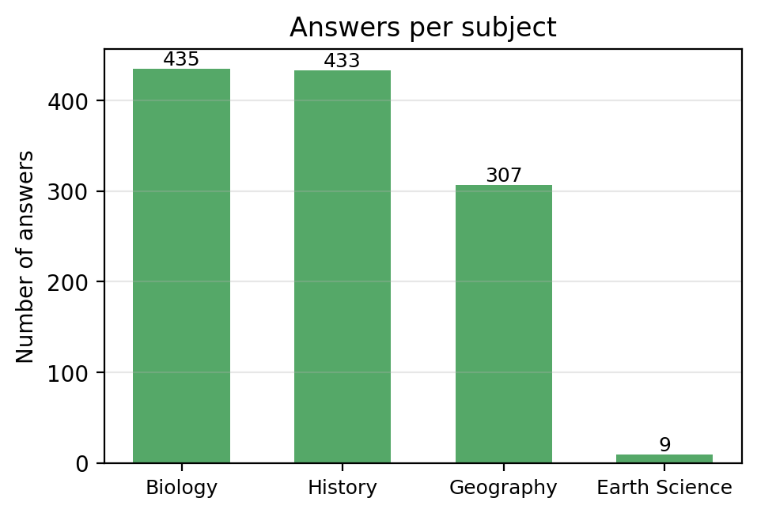 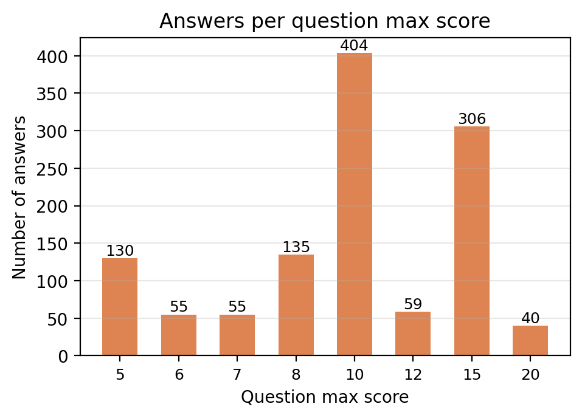

**1,184** answers · **41** questions · **203** students · 4 subjects · 2 schools · labels skewed (≈42% full credit).
Variants: `full` 1,184 · `no10c` 909 (full 5-class kept).

---

# V. Methodology · 2. Real label noise

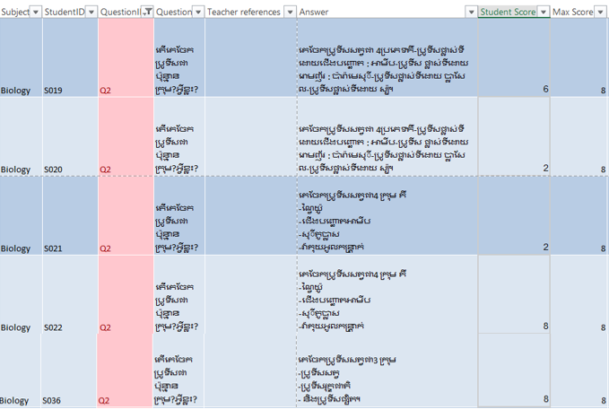

We drop the **Class 10C Biology** subset:

- Class 10C Biology Q2 (max 8): one identical answer text was scored **3, 4, 5, 6, 7, 8**.
- No model can learn from this, so the `no10c` variant removes it, lifting every pillar.

---

# V. Methodology · 2. Preprocessing (Khmer-aware)

```
NFC → strip invisibles → strip punctuation → khmer-nltk segmentation
```

- Strip invisibles (zero-width spaces, controls, bullet markers); digits kept as content.
- **khmer-nltk** segments the spaceless Khmer text into word units; heatmaps and feedback use these
  **readable tokens**.

---

# V. Methodology · 3. Models: Classical

- **Features:** character TF-IDF (`char_wb` 2–4-gram, 15k); no segmentation needed.
- **Pair vector:** `[ a ; b ; |a−b| ; a⊙b ; cos(a,b) ]`.
- **Head:** RBF support-vector regression. **Cost:** seconds on a CPU.

> The cheapest pillar, yet within **0.05 QWK** of the best.

---

# V. Methodology · 3. Models: RNN (BiLSTM + Attention)

- Character embedding → **bidirectional LSTM** (embed 128, hidden 128, 2 layers).
- **Additive attention** pooling → four-way interaction → MLP + sigmoid.

> Attention is architecture only, **not** the explanation. We use **SHAP**.

---

# V. Methodology · 3. Models: Transformer (encoders)

- **mBERT, XLM-R, GTE-multilingual**; dual + cross encoders.
- Freeze bottom 6 layers, 256 tokens, lr 2e-5.
- GTE RoPE cache rebuilt in full precision (avoids NaN).

> Champion cell: **GTE dual encoder + max-score feature**.

---

# V. Methodology · 3. Models: LLM (Qwen 3.5 4B + QLoRA)

- **QLoRA**: low-rank adapters on a frozen 4-bit base, feasible on one GPU.
- Prompt = question + reference + answer → model **emits the score**.
- **KhmerGrader family:** Qwen, Gemma, SEA-LION, each vs its zero-shot base.

> Two cheap levers: **max-score feature** (helps) and **threshold calibration** (ablation only).

---

# V. Methodology · 4. Explainability method (SHAP)

**SHAP word attribution** distributes the predicted score among the answer words by their Shapley values:

```
φ(i) = average marginal contribution of word i across coalitions
```

- **One unified method** for all four pillars; works on the non-differentiable SVR, **no gradients**.
- Model-agnostic; follows the explainable-scoring approach of **Kumar & Boulanger (2020)**.
- **Plausibility:** fraction of the top SHAP words that appear in the **reference answer**.

---

# V. Methodology · 5. Evaluation Metrics

| Axis | Metrics |
|---|---|
| **Agreement** | **QWK** (primary) · Cohen κ · Accuracy · macro-F1 |
| **Deployment** | exact match · adjacent (±1) |
| **Explainability** | **SHAP plausibility** (top SHAP words vs the reference) |

- **No confidence intervals.**

> All three axes are judged **together**.

---

<!-- _class: gallery -->

# VI. Experiment Setup · 1. Training

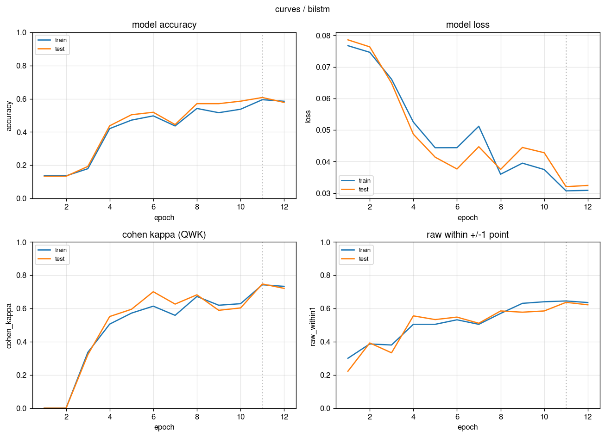 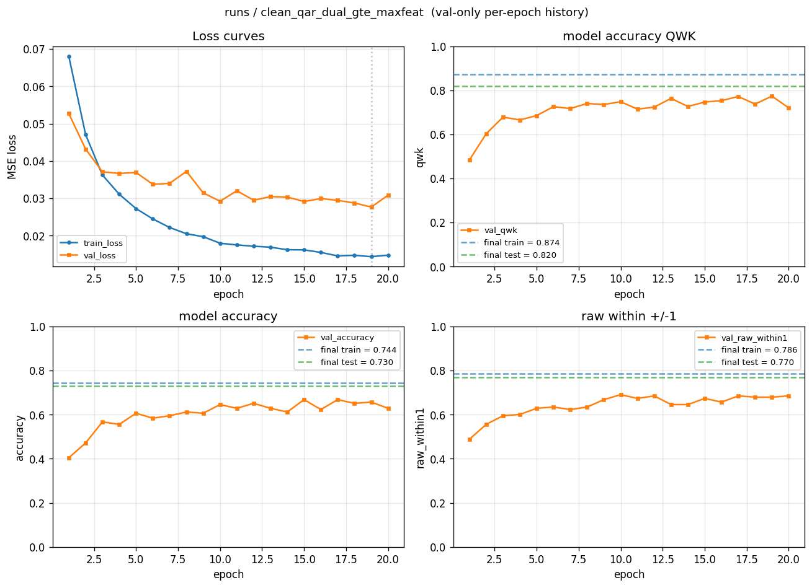

Train → select on **validation** → report **once** on test; **early stopping on val QWK**.
MISTI-HPC (NVIDIA A40); classical + BiLSTM on CPU, encoders + LLM on GPU. No hidden overfitting.

---

# VI. Experiment Setup · 2. XAI & prototype

- **XAI:** each champion explained on the same **135 test answers** at the Khmer word level with SHAP.
- **Prototype:** type Question + Reference + Answer → choose model → **score + heatmap + feedback**.
  - Same **SHAP** the study validates; readable display tokens.
  - Open-source LLM feedback + rule-based fallback.
  - **Teacher-assist, runs locally** (not publicly hosted).

---

# VII. Result · Per-pillar champions

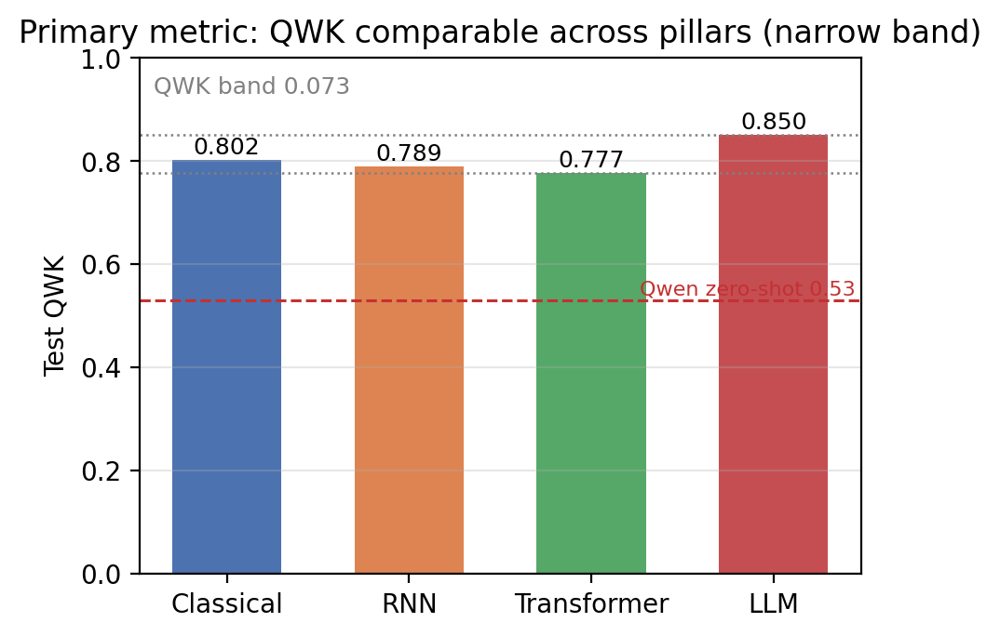

| Pillar | QWK | Exact | ±1 |
|---|---:|---:|---:|
| Classical | 0.795 | 0.20 | 0.71 |
| RNN | **0.845** | 0.54 | 0.77 |
| Transformer | 0.820 | 0.57 | 0.77 |
| **LLM (Qwen-KhmerGrader, FT)** | 0.843 | **0.66** | **0.83** |
| _Qwen base, zero-shot (ref.)_ | 0.500 | – | – |

- **Comparable on QWK** (0.05 band, the 4 trained pillars).
- The **LLM wins deployment** (exact 0.66); the base scores only **0.500 zero-shot** (+0.34 from fine-tuning).

---

# VII. Result · Deployment

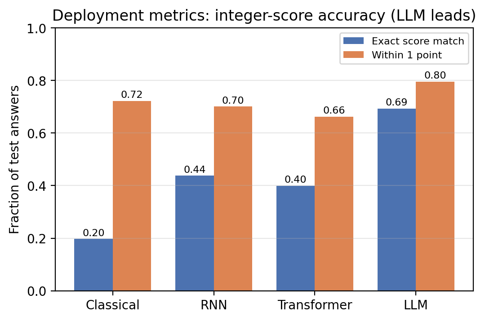

- **LLM (Qwen)** leads: exact **0.66**, within ±1 **0.83**, MAE ≈ **0.93 pt**.
- Its predicted marks follow the human distribution instead of collapsing to the mean.

---

<!-- _class: gallery -->

# VII. Result · Data cleaning & LLM lift

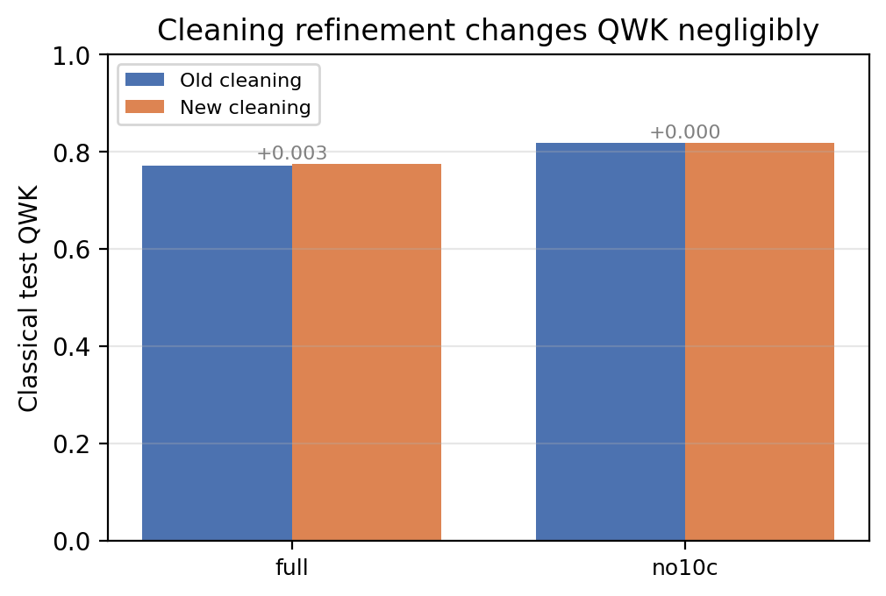 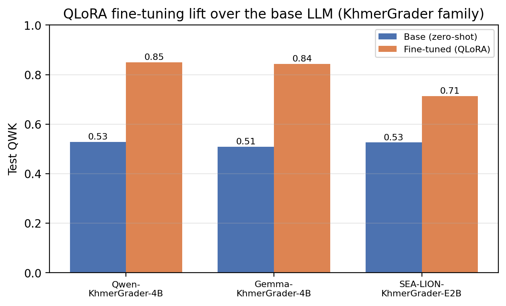

**Cleaning:** same GTE model 0.820 → 0.847 (**+0.027**), as much as any architecture swap.
**QLoRA lift (909):** Qwen +0.34, Gemma [pending], SEA-LION-E2B best exact **0.693** at 2.3B.

---

# VII. Result · Explainability (SHAP plausibility)

| Pillar | SHAP plausibility |
|---|---:|
| Classical | **0.66** |
| BiLSTM | 0.59 |
| Transformer | [HPC-pending] |
| LLM (Qwen, capped) | [HPC-pending] |

**Plausible for every pillar:** about two of every three highlighted words appear in the reference.
Global top SHAP words are subject-content terms. No trade-off between accuracy and explainability.

---

<!-- _class: gallery -->

# VII. Result · Heatmap example (SHAP)

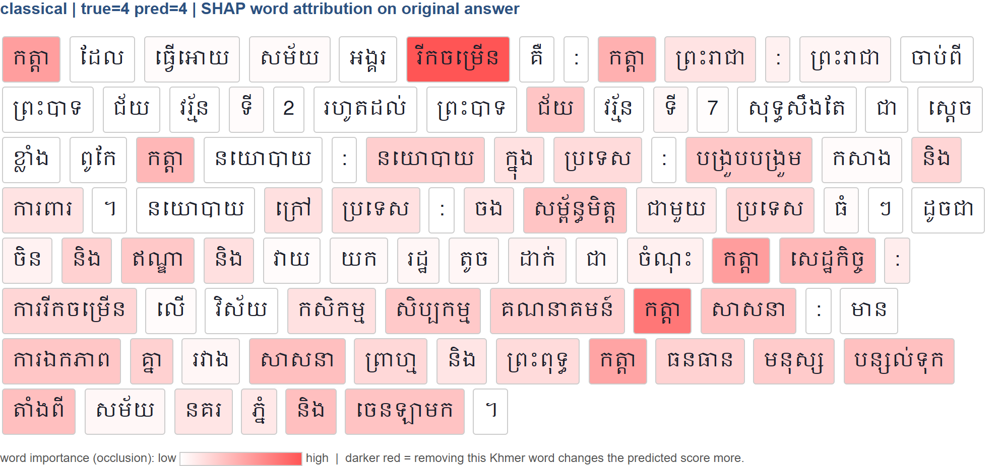

A real Khmer answer with **readable display tokens**; darker = higher SHAP attribution. This is exactly what the teacher sees in the prototype.

---

# VIII. Limitations & Future Works

**Limitations**
- Single grader, no inter-annotator agreement.
- Small corpus (~909–1,184; only 41 questions, 4 subjects).
- LLM least sharp; plausibility = automatic proxy.
- No field study yet.

**Future Works**
- Second grader to measure a human ceiling.
- Larger, multi-school corpus; Khmer pretraining.
- Human plausibility study; cross-lingual transfer.
- Feedback quality + teacher field study.

---

# IX. Conclusion

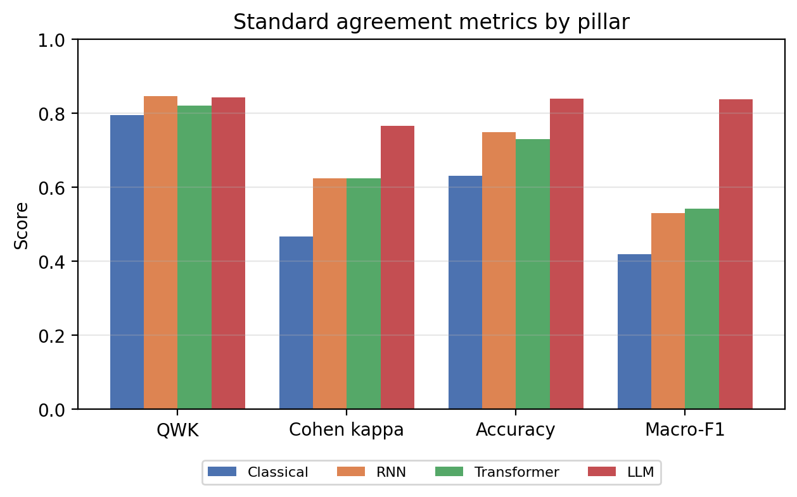

- Four pillars reach **QWK 0.80–0.85**; a 30-second CPU model is within 0.05 of the LLM.
- **Data cleaning** lifts +0.027 QWK (biggest step: removing 10C Biology).
- **LLM wins deployment** (66% exact, 83% within one point).
- **SHAP is plausible for every pillar**, strongest for the small BiLSTM.

> Accuracy, deployment, and **explainability** must be judged together.

---

# References

<span class="small">

[1] Mohler et al. (2011). *Grading short answers with semantic similarity and dependency alignments.* ACL.
[2] Dzikovska et al. (2013). *SemEval-2013 Task 7.* *SEM.
[3] Kumar & Boulanger (2020). *Explainable automated essay scoring.* Frontiers in Education.
[4] Sung, Dhamecha & Mukhi (2022). *A survey on ASAG with deep learning.* arXiv:2204.03503.
[5] Tan et al. (2025). *Review on automated grading in STEM using AI.* Mathematics 13(17).
[6] Chang & Ginter (2024). *GPT-4 on automated short answer grading.* arXiv:2309.09338.
[7] Soulimani (Alaoui) et al. (2024). *Deep learning based Arabic short answer grading.* IJECE 14(1).
[8] Pinto & Shin (2025). *Attribution methods in ASAG systems.* J. Educational Measurement 62(2).
[9] Xu et al. (2025). *XAI for education: rubric-aligned chain-of-thought prompting.* Preprints.org.
[10] Lachana (2025). *Automated scoring for open-ended questions in Dutch education.* MSc, Utrecht.
[11] Lyu, Apidianaki & Callison-Burch (2024). *Towards faithful model explanation in NLP.* Comput. Linguistics 50(2).
[12] DeYoung et al. (2020). *ERASER.* ACL.
[13] Devlin et al. (2019). *BERT.* NAACL-HLT.
[14] Dettmers et al. (2023). *QLoRA.* NeurIPS.
[15] Buoy et al. (2022). *Pretrained models and data for Khmer.* Tsinghua Science and Technology.
[16] Hoang (2020). *khmer-nltk.* · Huot et al. (2025). *Educating in the age of AI: Cambodia.* JETELI.

</span>

---

<!-- _class: gallery -->

# Appendix · Confusion & predictions

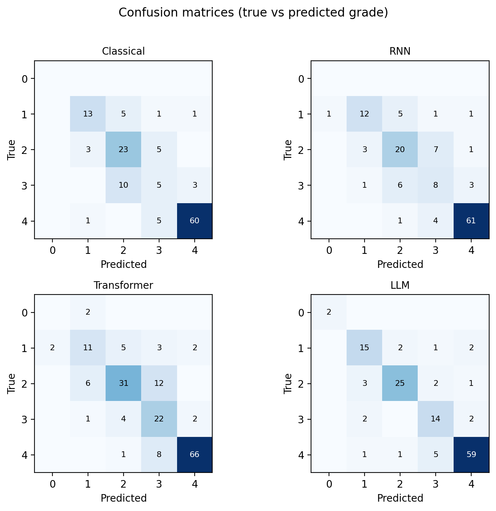 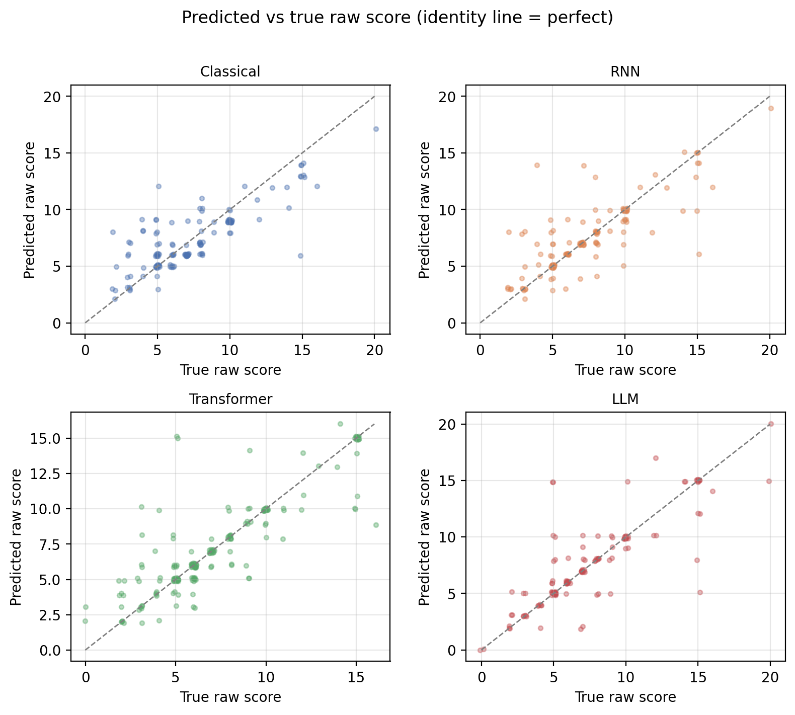

<span class="small">Confusion matrices (left) and predicted-vs-true raw scores (right): mass clusters on the
diagonal; off-diagonal is largest for the classical model, smallest for the LLM.</span>

---

<!-- _class: gallery -->

# Appendix · Heatmaps (BiLSTM, Encoder, LLM)

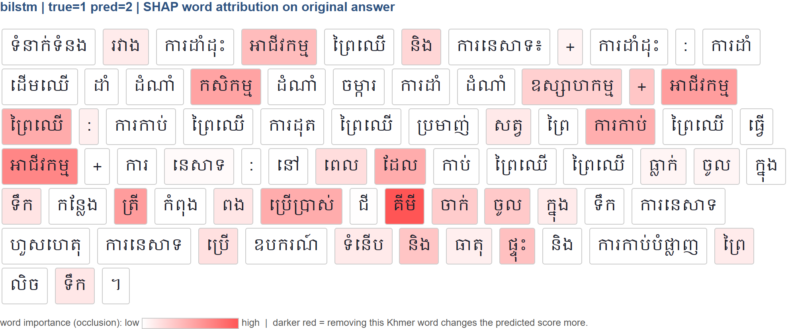

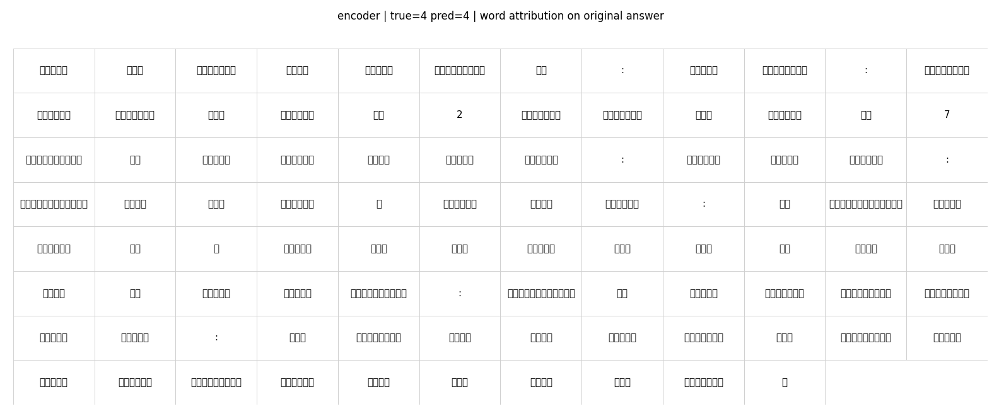

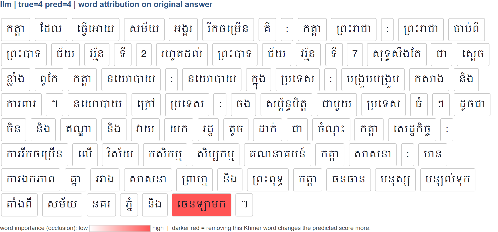

<span class="small">SHAP word-attribution heatmaps for the other three pillars (browser-shaped Khmer, readable tokens).</span>

---

<!-- _class: gallery -->

# Appendix · More figures & details

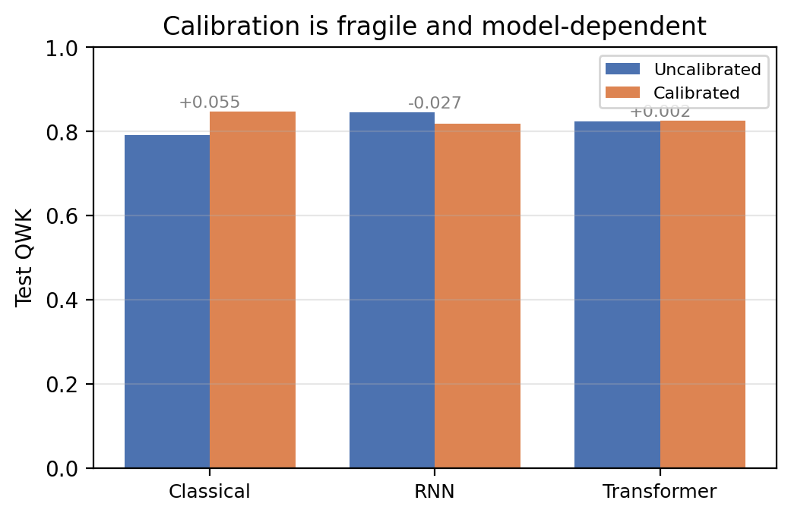 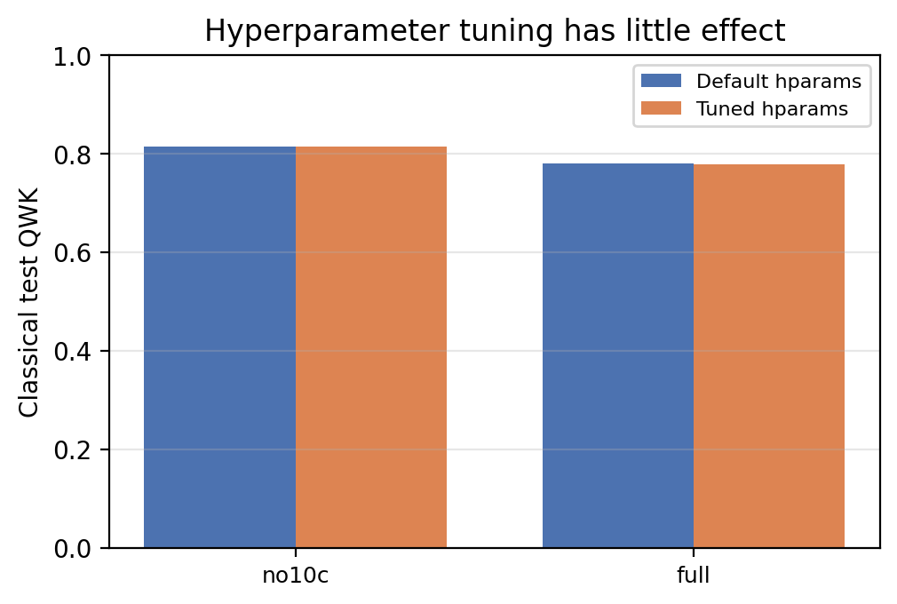 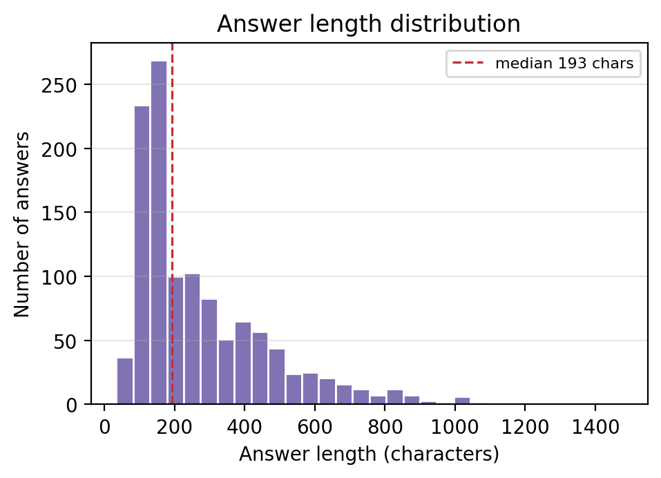

<span class="small">**Calibration** is fragile (helps classical, hurts BiLSTM); **classical tuning** shifts test QWK
< 0.002; **answer length** median 193 chars. **Hyperparameters:** TF-IDF `char_wb`(2,4)/15k, SVR C=1 RBF ·
BiLSTM 128/128/2, lr 1e-3 · encoders freeze 6, lr 2e-5 · LLM Qwen 3.5 4B QLoRA r=16 · seed 42.
**Compute:** classical seconds on CPU, full grid ≈ 40 GPU-hours (A40). **Ethics:** anonymised minors'
answers, access via school Director, pseudonymous IDs, human-in-the-loop. Repository: [insert link].</span>

---

# THANK YOU

<br><br>

**Royal University of Phnom Penh · Faculty of Engineering**

**Presented by:** Phork Norak
**Advisor:** Dr. Khim Chamroeun
**Date:** [Month] 2026

<br>

*Questions?*
